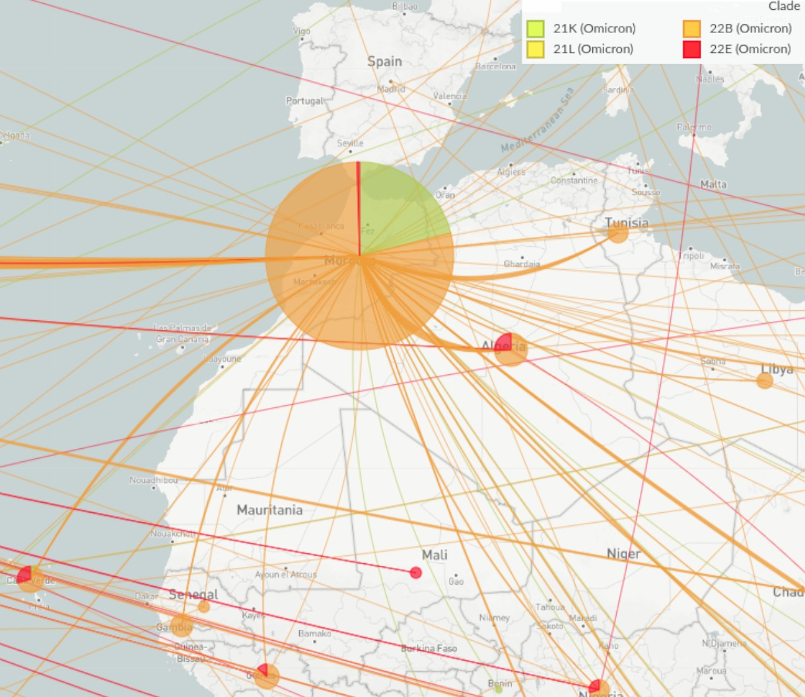

# SARS-CoV-2-Morocco

Among the numerous variants of severe acute respiratory syndrome coronavirus 2 (SARS-CoV-2) that have been reported worldwide, the emergence of Omicron variant has drastically changed the landscape of the coronavirus disease (COVID-19) pandemic. Here, we analyzed the genetic diversity of SARS-CoV-2 genomes of Omicron variant after one year of its detection in Morocco in order to understand its genomic dynamics and its potential introduction sources. We identified a total of 999 non-unique mutations distributed across 92 Omicron lineages circulating in Morocco of which 13 were specific to the country. Our findings suggest multiple introductory sources of Omicron variant to Morocco. Also, we found that four Omicron clades are more infectious and able to spread as compared to other Omicron clades. Remarkably, a clade of Omicron is particularly more transmissible and has become the dominant variant worldwide. Moreover, our assessment of Receptor-Binding Domain (RBD) mutations impact showed that the Spike K444T and N460K mutations enabled a clade higher ability of immune vaccine escape. In conclusion we note a decrease in the fatality rate in during the expansion of Omicron variant in Morocco as well as in the rest of the world and that despite being more contagious than other variants, Omicron causes less severe illness.

